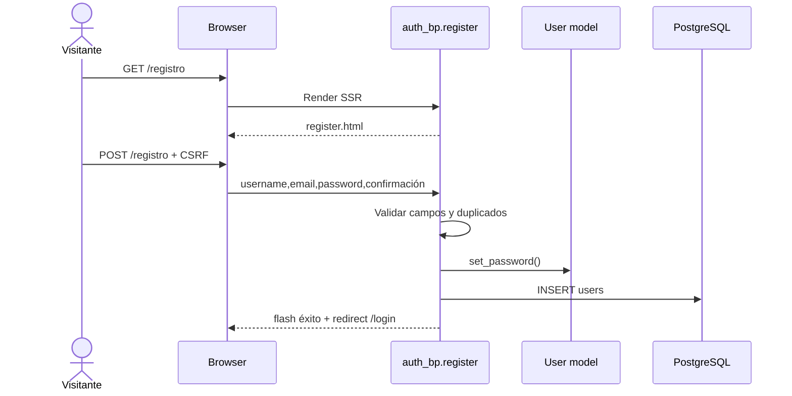
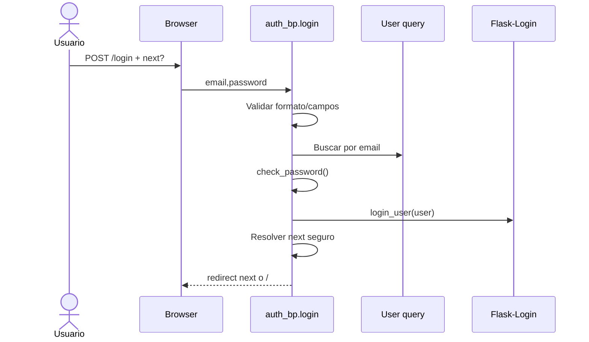
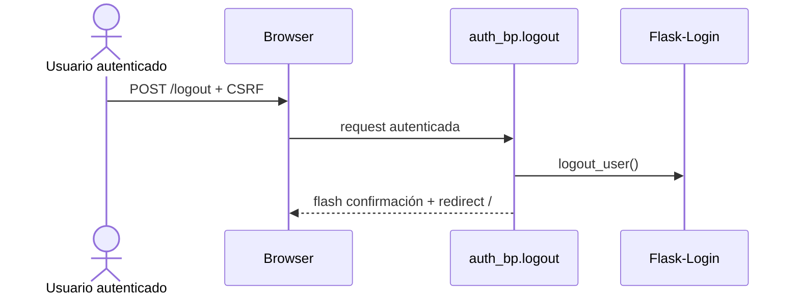

# Design: Autenticación SSR base y visibilidad de sesión

## Enfoque técnico

Se incorporará un blueprint `auth_bp` SSR mínimo, registrado desde `app/routes/__init__.py`, apoyado en las extensiones ya centralizadas en `app/extensions.py`. El change implementa solo identidad y sesión: registro, login, logout por POST y reflejo visual del estado autenticado en templates. No agrega CRUD privado ni UI admin; eso queda dependiente del Change 4.

## Decisiones de arquitectura

### Decisión: Auth SSR sin Flask-WTF forms

| Opción | Trade-off | Decisión |
|---|---|---|
| Flask-WTF `Form` | Mejor encapsulación, más archivos | No |
| Leer `request.form` + validación explícita | Menos abstracción, pero consistente con el MVP y docs actuales | Sí |

**Rationale:** el proyecto ya usa templates mínimos y no tiene capa formal de forms; mantener validación en ruta evita sobreingeniería y respeta el roadmap.

### Decisión: Validación duplicada entre ruta y modelo

| Opción | Trade-off | Decisión |
|---|---|---|
| Solo modelo | Menor duplicación, peor UX | No |
| Ruta + modelo | Duplica reglas, pero mejora feedback e integridad | Sí |

**Rationale:** coincide con la decisión cerrada del roadmap backend: UX clara en SSR y protección de dominio ante escrituras inválidas.

### Decisión: Redirects con `next` estrictamente local

| Opción | Trade-off | Decisión |
|---|---|---|
| Aceptar cualquier `next` | UX simple, inseguro | No |
| Validar `next` relativo o mismo host; fallback a home | Algo más de código, evita open redirect | Sí |

**Rationale:** el scope pide seguridad razonable sin endurecimiento global. Se resuelve con helper local en `auth.py` y fallback a `main_bp.home`.

### Decisión: Navbar autenticada muestra `username`, nunca `email`

| Opción | Trade-off | Decisión |
|---|---|---|
| Mostrar email | Identifica mejor al usuario, expone dato sensible | No |
| Mostrar username | Menor exposición, consistente con UI pública | Sí |

**Rationale:** el `username` es el identificador visible del dominio; evita filtrar email en SSR y mantiene fuera de alcance cualquier UI diferenciada por `is_admin`.

## Flujos relevantes

## Contratos SSR e interfaces

- `GET /registro` y `GET /login`: si `current_user.is_authenticated`, redirigen a `/`.
- `POST /registro`: re-renderiza `auth/register.html` con valores no sensibles y errores por campo; ante éxito, flash `success` y redirect a `/login`.
- `POST /login`: muestra errores específicos solo para campos/formato; para credenciales inválidas usa flash o error general genérico. Si `next` no es seguro, redirige a `/`.
- `POST /logout`: requiere `@login_required`, CSRF válido y no acepta GET.
- `login.html`: formulario POST con `email`, `password`, `csrf_token`, enlace a registro y área para error general.
- `register.html`: formulario POST con `username`, `email`, `password`, `confirm_password`, `csrf_token`, errores por campo y enlace a login.
- `partials/navbar.html`: usa `current_user.is_authenticated` para alternar entre links públicos (`/login`, `/registro`) y bloque autenticado con `username` + formulario POST `/logout`; sin email ni UI admin.

## Cambios de archivos

| Archivo | Acción | Descripción |
|---|---|---|
| `app/routes/auth.py` | Modificar | Implementar blueprint, validaciones, helper de `next`, flashes y guards de usuario autenticado |
| `app/routes/__init__.py` | Modificar | Registrar `auth_bp` |
| `app/extensions.py` | Ajustar | Confirmar `login_view`, `login_message` y categoría para futuras rutas protegidas |
| `app/__init__.py` | Mantener/validar | Sin nueva extensión; solo preservar wiring actual |
| `app/templates/auth/login.html` | Modificar | Contrato SSR del login |
| `app/templates/auth/register.html` | Modificar | Contrato SSR del registro |
| `app/templates/partials/navbar.html` | Modificar | Estado autenticado visible con `username` y logout POST |
| `app/templates/base.html` | Validar | Mantener inclusión de navbar y flashes |

## Estrategia de testing

No se agrega framework nuevo. La verificación prevista es manual: registro exitoso, duplicados por campo, login válido/inválido, redirect de usuario autenticado fuera de `/login` y `/registro`, logout solo por POST con CSRF y navbar SSR reflejando sesión.

## Riesgos y trade-offs

- Mensajes demasiado específicos en login podrían filtrar existencia de cuentas; por eso solo los errores de formato/campo serán específicos.
- Sin Flask-WTF forms hay más lógica en ruta, pero menos superficie nueva para este MVP.
- La visibilidad de sesión en navbar crea dependencia visual que el Change 4 reutilizará; mantenerla neutra evita adelantar perfil, biblioteca o admin UI.

## Fuera de alcance y dependencia

Quedan fuera: perfil, biblioteca, reseñas privadas, panel/admin UI, CTAs a acciones futuras y endurecimiento global de errores/CSRF. Este diseño prepara la base para el Change 4, que recién consumirá `@login_required`, sesión visible y redirects de `login_manager` ya configurados.

## Open Questions

- [ ] Ninguna bloqueante; solo hay que mantener consistencia entre comentarios placeholder y la decisión final de `POST /logout`.
