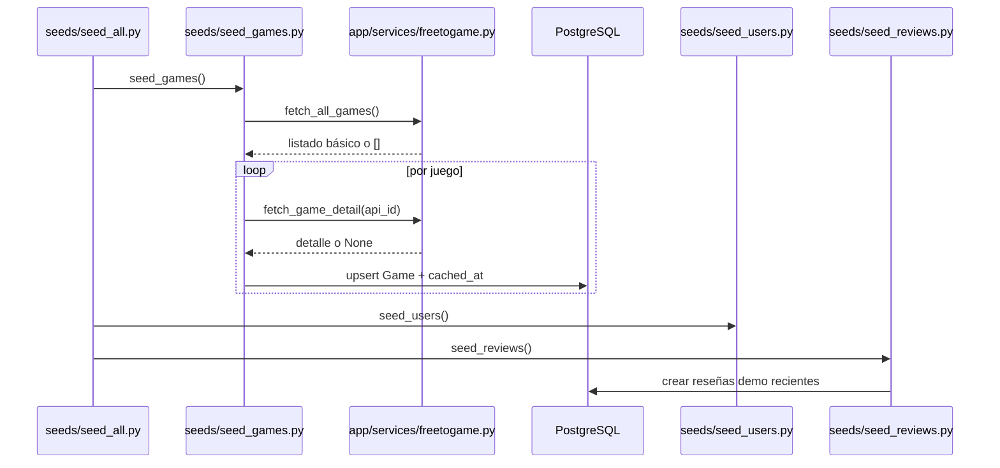
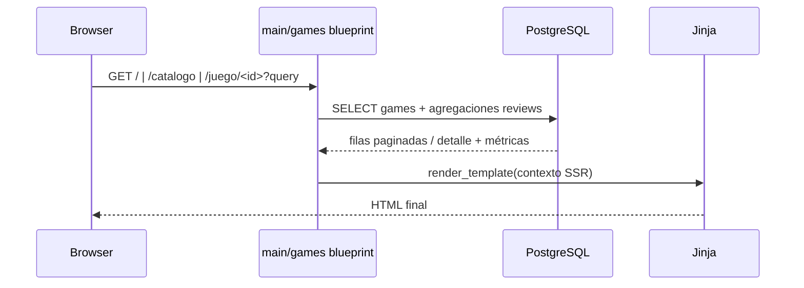

# Design: Implementar experiencia pública de lectura para home, catálogo y ficha de juego

## Enfoque técnico

La experiencia pública SSR leerá exclusivamente desde PostgreSQL local. `app/services/freetogame.py` quedará aislado al seed inicial y al refresh manual; `main` y `games` no consumirán la API externa. El cambio cierra el contrato mínimo Jinja de `home.html`, `catalog.html` y `detail.html` para que backend y templates evolucionen con una interfaz estable.

## Decisiones de arquitectura

| Decisión | Choice | Alternativas | Rationale |
|---|---|---|---|
| Caché como fuente pública | Home, catálogo y detalle consultan solo `games`/`reviews` locales | Leer FreeToGame en requests GET | Respeta arquitectura MVC documentada, elimina latencia/caídas externas y mantiene SSR determinista. |
| Query params como estado del catálogo | `q`, `genre`, `platform`, `publisher`, `sort`, `page` son la única fuente de verdad | Estado en sesión o formularios POST | URL compartible, paginación consistente y comportamiento SSR predecible. Cambios de filtros reinician `page=1`. |
| Agregaciones desacopladas del modelo | `review_count` y `avg_rating` se calculan con `outer join + group by`/subquery de `Review` | Persistir métricas en `games` | Evita desnormalización y mantiene ausencia de reseñas como `NULL`, no como `0`. |
| Destacados home híbridos | Ranking por volumen reciente + rating promedio reciente en ventana móvil de 14 días; empate por `release_date` descendente | Aleatorio o rating histórico global | Produce una home viva con datos demo recientes sin sesgar por reseñas antiguas. |
| Contrato Jinja explícito | Templates reciben view-models y flags mínimos documentados | “Pasar el modelo y ver” | En SSR la plantilla es parte de la arquitectura: define qué datos resuelve la ruta, qué branches de UI existen y qué parciales son reutilizables. |

## Flujos y data flow

- `GET /`: selecciona 8 destacados desde reseñas de los últimos 14 días; score = prioridad por `review_count_recent` y luego `avg_rating_recent`; empate final por `release_date` más reciente.
- `GET /catalogo`: aplica filtros por query string, orden soportado (`alphabetical`, `review_count`, `avg_rating`, `release_date`) y paginación server-side. En órdenes agregados, juegos sin reseñas quedan al final usando `NULLS LAST`/equivalente y fallback por `release_date` desc.
- `GET /juego/<id>`: obtiene `Game`, métricas agregadas (`review_count`, `avg_rating`) y reseñas read-only con autor. `screenshots` vacías ocultan sección; requisitos totalmente ausentes muestran mensaje breve en vez de tabla vacía.

## Contrato Jinja SSR

- `main/home.html`: `featured_games` (8 items con métricas visibles) y `catalog_url`.
- `games/catalog.html`: `pagination`, `games`, `current_filters`, `filter_options` (`genres`, `platforms`, `publishers`), `total_count`, `has_results`.
- `games/detail.html`: `game`, `review_summary` (`count`, `avg_rating|None`), `reviews`, `screenshots`, `requirements`, `has_requirements`.
- `partials/game_card.html` recibe un `game` enriquecido con `review_count` y `avg_rating|None`.

## Cambios de archivos

| Archivo | Acción | Descripción |
|---|---|---|
| `app/services/freetogame.py` | Modificar | Cliente HTTP robusto, timeouts y retorno seguro para seed/refresh manual. |
| `seeds/seed_games.py` | Modificar | Upsert por `api_id`, mapping de detalle, tolerancia a fallos parciales. |
| `seeds/seed_users.py` | Modificar | Usuarios demo idempotentes para soportar reseñas públicas. |
| `seeds/seed_reviews.py` | Modificar | Reseñas recientes suficientes para rankings/agregados. |
| `seeds/seed_all.py` | Modificar | Orquestación y logging del flujo completo. |
| `app/routes/main.py` | Modificar | Home SSR con destacados calculados. |
| `app/routes/games.py` | Modificar | Catálogo query-driven y detalle read-only. |
| `app/routes/__init__.py` | Modificar | Registro de blueprints públicos. |
| `app/templates/main/home.html` | Modificar | Contrato mínimo SSR de home. |
| `app/templates/games/catalog.html` | Modificar | Contrato mínimo SSR de catálogo. |
| `app/templates/games/detail.html` | Modificar | Contrato mínimo SSR de ficha pública. |
| `app/templates/partials/game_card.html` / `pagination.html` | Modificar | Reuso de cards y preservación de query params. |

## Riesgos y trade-offs

- Ordenar por agregados puede exigir subqueries explícitas para no romper paginación ni duplicar filas.
- Seeds demo pobres distorsionan home y órdenes por popularidad; el diseño depende de reseñas recientes suficientes.
- `release_date` es `String`; el desempate funcionará solo si el formato queda normalizado desde seed.

## Testing y rollout

- Pruebas manuales objetivo: seed inicial idempotente, refresh manual tolerante a fallos parciales, `/`, `/catalogo` y `/juego/<id>` leyendo solo caché local, preservación de query params en paginación y órdenes agregados con juegos sin reseñas.
- No requiere migración de esquema; el rollout es habilitar rutas SSR sobre tablas ya existentes y poblar datos con `seed_all.py`.

## Fuera de alcance y dependencias

Quedan fuera de scope auth, formularios POST públicos, CRUD privado, biblioteca, perfil, admin y consumo online de FreeToGame en runtime. Este change deja el contrato SSR y la base de datos cacheada que deberán reutilizar los changes 3/4/5 para auth, escritura/edición de reseñas y biblioteca/admin sin redefinir rutas públicas ni métricas de lectura.
