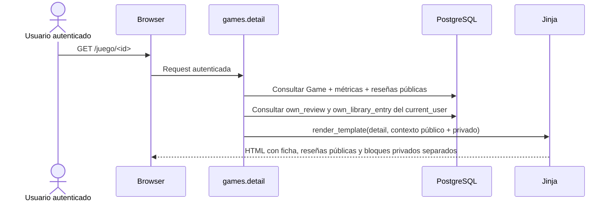
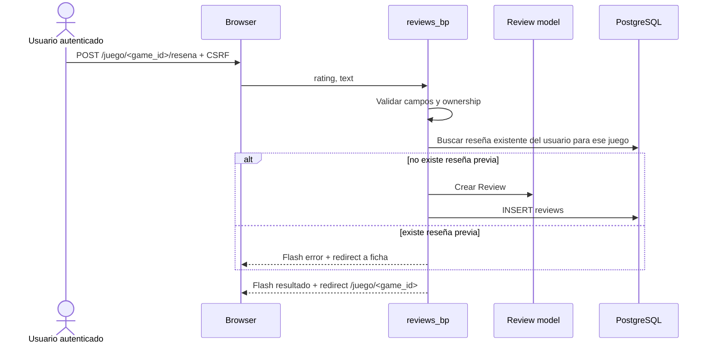
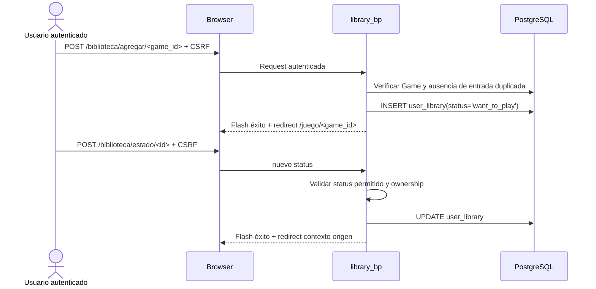
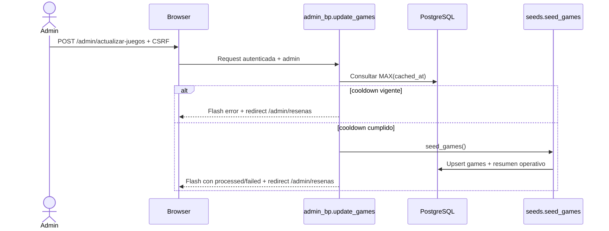

# Design: Áreas privadas SSR del usuario y administración moderada

## Enfoque técnico

El change ampliará la superficie SSR ya existente sin crear un subsistema privado paralelo. La ficha pública de juego (`games.detail`) seguirá siendo la ruta canónica de lectura y, cuando exista sesión autenticada, se enriquecerá con el contexto privado mínimo del usuario: reseña propia y estado en biblioteca. Las escrituras y operaciones de ownership vivirán en blueprints dedicados (`reviews_bp`, `library_bp`, `profile_bp`, `admin_bp`) para mantener separadas lectura pública, acciones privadas y administración.

Esto encaja con el estado real del repositorio: `app/routes/__init__.py` todavía registra solo `main_bp`, `auth_bp` y `games_bp`; `app/decorators.py` mantiene `admin_required` como placeholder; y `seed_all.py` aún orquesta solo juegos, usuarios y reseñas. El design completa exactamente esas piezas pendientes, sin reabrir auth ni rehacer catálogo público.

## Decisiones de arquitectura

| Decisión | Choice | Alternativas | Rationale |
|---|---|---|---|
| Hub privado sobre ficha existente | Reutilizar `GET /juego/<id>` y enriquecer su contexto SSR cuando el usuario esté autenticado | Crear una ficha privada separada (`/juego/<id>/privado`) | Evita duplicar lectura pública, métricas y plantilla base. La autenticación amplía la ficha; no la reemplaza. |
| Manejo de formularios privados | Leer `request.form` + validación explícita en rutas, manteniendo CSRF global ya configurado | Introducir Flask-WTF `Form` por feature | Sigue la línea ya usada en auth, respeta el alcance TFG FP y evita abrir una capa de forms formal en mitad del proyecto. |
| Frontera entre reseña de usuario y moderación admin | CRUD propio en `reviews_bp`; moderación global solo en `admin_bp` | Reutilizar las mismas rutas de usuario para admins | Mantiene ownership claro: usuario gestiona lo suyo, admin modera desde un contexto separado. Reduce branching raro en rutas de usuario. |
| Alta de biblioteca progresiva | `POST /biblioteca/agregar/<game_id>` crea entrada con `want_to_play`; cambio de estado ocurre después | Elegir estado en el alta inicial | Reduce fricción en la ficha y mantiene una UX simple: primero “meter en biblioteca”, luego “organizar”. |
| Cooldown de refresh admin basado en datos | Calcular cooldown desde `MAX(games.cached_at)` en BD | Timestamp en memoria o archivo temporal | Persiste entre reinicios, funciona con Docker/SSR y se apoya en un campo del dominio ya existente. |
| Resultado operativo de refresh | Ajustar `seed_games()` para devolver un resumen ligero (`processed`, `failed`) consumible por admin y seed general | Mantener retorno `int` o diseñar jobs asíncronos | Permite feedback útil sin meter colas ni background jobs. Es una mejora pequeña, suficiente y defendible para FP. |
| Perfil acotado | `/perfil` como resumen simple con contadores, últimas reseñas y accesos directos | Dashboard complejo o vista dedicada de “mis reseñas” | Mantiene navegación útil sin abrir superficies nuevas ni duplicar la ficha como centro de gestión. |
| Contratos SSR explícitos | Cada vista privada declara su contexto mínimo esperado | “Pasar modelos y resolver en template” | En SSR, la plantilla es parte del contrato. Explicitar inputs mantiene consistencia entre rutas, templates y futuras verificaciones. |

## Flujos y data flow

## Contratos SSR e interfaces

- `GET /juego/<id>` sigue renderizando `games/detail.html` como ficha pública base, pero añade contexto privado solo si `current_user.is_authenticated`.
- `games/detail.html` recibirá como mínimo: `game`, `reviews`, `review_summary`, `screenshots`, `requirements`, `has_requirements`, y además `own_review`, `library_entry`, `library_status_options`, `can_manage_private`. Si `own_review` es `None`, la vista muestra alta; si existe, muestra bloque de gestión.
- `POST /juego/<game_id>/resena` crea reseña; `GET|POST /resena/<id>/editar` usa `reviews/form.html`; `POST /resena/<id>/eliminar` elimina solo reseña propia.
- `reviews/form.html` recibirá: `game`, `review`, `mode` (`edit`), `form_values`, `validation_errors`, `cancel_url`.
- `GET /mi-biblioteca` renderizará `library/my_library.html` con: `entries`, `current_status`, `available_statuses`, `has_results`.
- `POST /biblioteca/estado/<id>` y `POST /biblioteca/quitar/<id>` aceptarán un retorno relativo seguro al contexto origen; fallback a `/mi-biblioteca`.
- `GET /perfil` renderizará `profile/index.html` con: `user`, `stats` (`review_count`, `library_count`), `recent_reviews`, `links` (catálogo, biblioteca).
- `GET /admin/resenas` renderizará `admin/reviews.html` con: `reviews`, `has_results`, `refresh_status` (`cooldown_active`, `seconds_remaining`).
- Los empty states seguirán siendo simples: la vista decide mensaje útil cuando `has_results` sea falso o cuando listas/colecciones estén vacías.
- `partials/flash_messages.html` y `base.html` se mantienen como contrato transversal de feedback; el change debe apoyarse en ellos sin inventar un sistema paralelo.

## Consultas y composición de datos

- **Ficha autenticada**: `games.detail` resolverá primero el contexto público actual (`Game`, métricas agregadas, reseñas públicas con `joinedload(Review.user)`) y, si hay sesión, hará consultas separadas para `own_review` y `library_entry`. Separar estas consultas mantiene el template simple y evita mezclar la reseña propia dentro del listado público general.
- **CRUD de reseñas**: `reviews_bp` usará filtros por `(current_user.id, game_id)` para crear/verificar unicidad y `get_or_404` + chequeo de ownership para editar/eliminar. Admin no reutiliza estas rutas para reseñas ajenas.
- **Biblioteca**: `library_bp` operará sobre `UserLibrary` con ownership por `current_user.id`. Los estados válidos se resolverán desde una constante local alineada al dominio cerrado (`want_to_play`, `playing`, `played`).
- **Perfil**: resolverá contadores con queries agregadas ligeras y una lista corta de reseñas recientes con join a `Game`; no necesita métricas complejas ni breakdown avanzado.
- **Panel admin**: listará reseñas globales ordenadas por fecha descendente, usando join/`joinedload` a `User` y `Game` para disponer de autor y juego sin N+1 evidente en SSR.
- **Refresh admin**: leerá `MAX(Game.cached_at)` para calcular cooldown y ejecutará `seed_games()` solo cuando la ventana haya expirado. Si no hay juegos cacheados todavía, el refresh se considerará permitido.

## Cambios de archivos

| Archivo | Acción | Descripción |
|---|---|---|
| `app/decorators.py` | Modificar | Implementar `admin_required` real, consistente con `@login_required` y feedback por acceso denegado. |
| `app/routes/__init__.py` | Modificar | Registrar `reviews_bp`, `library_bp`, `profile_bp` y `admin_bp` además de los blueprints ya activos. |
| `app/routes/games.py` | Modificar | Enriquecer `detail()` con contexto privado autenticado sin romper la lectura pública existente. |
| `app/routes/reviews.py` | Modificar | Implementar creación, edición y eliminación de reseña propia con validación y flashes. |
| `app/routes/library.py` | Modificar | Implementar listado filtrable, alta, cambio de estado y eliminación de biblioteca. |
| `app/routes/profile.py` | Modificar | Implementar perfil SSR simple con contadores y reseñas recientes. |
| `app/routes/admin.py` | Modificar | Implementar listado de moderación, borrado admin y refresh de catálogo con cooldown. |
| `seeds/seed_games.py` | Modificar | Devolver resumen operativo ligero para admin/seed_all además del comportamiento idempotente actual. |
| `seeds/seed_library.py` | Crear | Seed idempotente y variado para sostener biblioteca/perfil en la demo. |
| `seeds/seed_all.py` | Modificar | Orquestar `seed_library` tras reseñas y consumir el nuevo contrato de resultado del seed si aplica. |
| `app/templates/games/detail.html` | Modificar | Combinar capa pública existente con bloques privados separados. |
| `app/templates/reviews/form.html` | Modificar | Contrato SSR del formulario de edición de reseña. |
| `app/templates/library/my_library.html` | Modificar | Lista filtrable por estado, acciones POST y empty state. |
| `app/templates/profile/index.html` | Modificar | Perfil simple con datos, contadores y accesos directos. |
| `app/templates/admin/reviews.html` | Modificar | Tabla de moderación y estado del refresh admin. |
| `app/templates/partials/flash_messages.html` | Validar | Reutilizar categorías y estructura de feedback en todas las acciones nuevas. |

## Estrategia de verificación

La validación prevista sigue siendo manual y narrativa, no por framework nuevo. El recorrido objetivo del change es:

1. Login como usuario demo.
2. Abrir ficha de juego autenticada.
3. Añadir juego a biblioteca.
4. Crear reseña válida.
5. Volver a la ficha y verificar sustitución de alta por gestión de reseña existente.
6. Editar y luego eliminar la reseña propia.
7. Abrir `/mi-biblioteca` y filtrar por estado.
8. Abrir `/perfil` y verificar contadores + reseñas recientes.
9. Login como admin.
10. Moderar una reseña ajena y ejecutar refresh de catálogo verificando cooldown.

No requiere migración de esquema: se apoya en tablas, constraints y `cached_at` ya existentes.

## Riesgos y trade-offs

- Enriquecer `games.detail` con capa privada aumenta su responsabilidad; la mitigación es separar contexto público y privado con claves explícitas, no con branching difuso en template.
- Cambiar el contrato de retorno de `seed_games()` obliga a tocar `seed_all.py` y `admin.py`, pero evita feedback pobre o ambiguo en refresh admin.
- Basar el cooldown en `MAX(cached_at)` es suficientemente robusto para FP, aunque mide “último caché persistido” y no una cola/lock real de ejecución concurrente.
- Ownership y moderación pueden cruzarse si se mezclan rutas; por eso el design separa estrictamente CRUD propio y borrado admin.
- La biblioteca tendrá más de un contexto de uso (ficha y lista); aceptar un retorno relativo seguro evita UX rota sin introducir redirects abiertos.

## Fuera de alcance y dependencias

Quedan fuera: dashboard complejo, vista dedicada de “mis reseñas”, filtros avanzados o acciones masivas en admin, background jobs para refresh, métricas sofisticadas de perfil, refactor global de navbar o endurecimiento transversal de errores más allá de este flujo.

Este design depende de artefactos ya cerrados en changes previos: autenticación SSR base, catálogo/ficha pública y dominio persistente. También reutiliza la política del proyecto: POST para escritura, CSRF obligatorio y validación server-side además de la integridad de modelo.

## Open Questions

- [ ] Ninguna bloqueante. La única decisión ya cerrada por este design es que `seed_games()` deje de devolver solo un entero y pase a un resumen ligero para sostener feedback admin útil.
