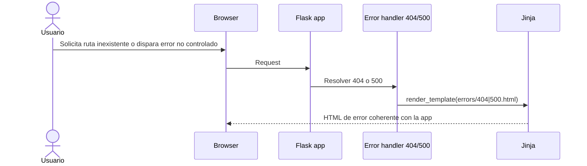
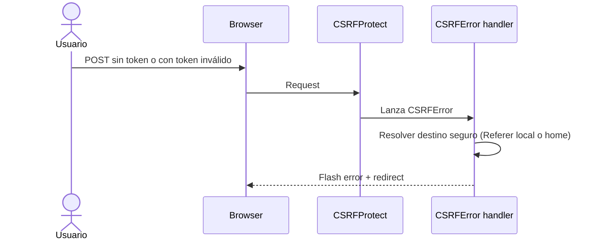
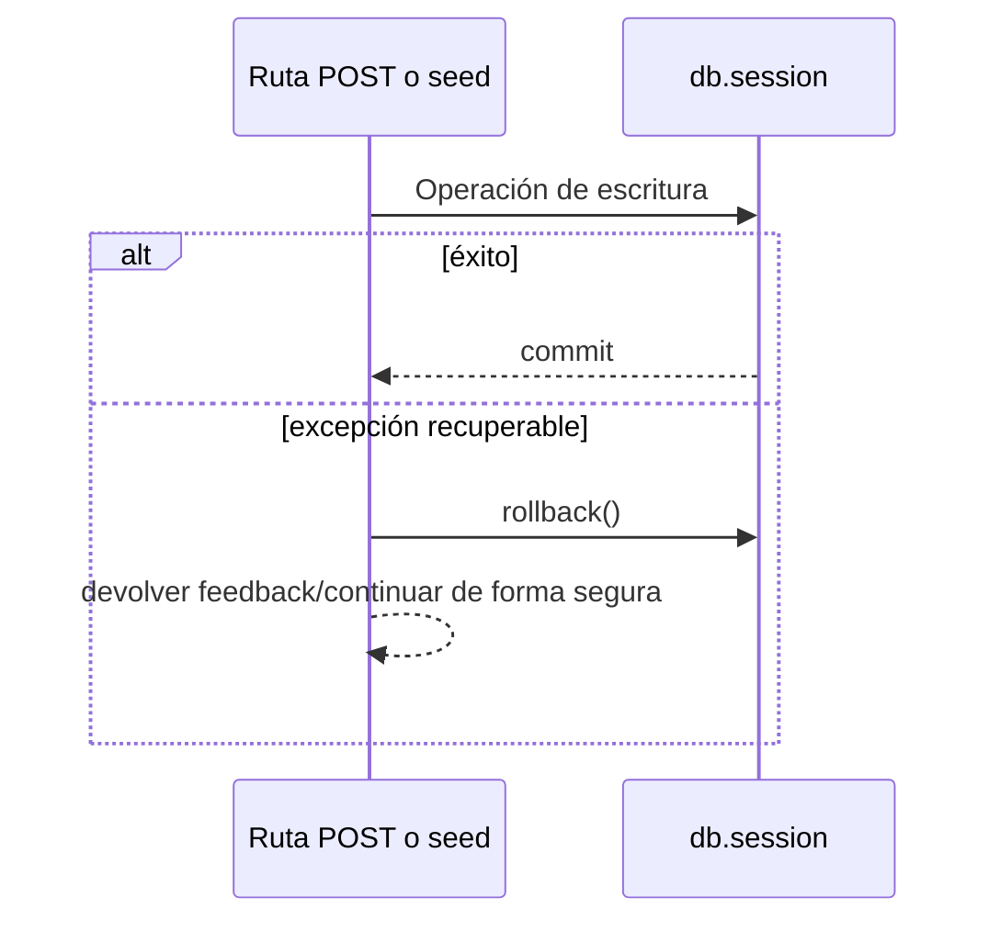

# Design: Hardening final del backend y páginas de error

## Enfoque técnico

Este change cerrará la Fase 7 del backend como un trabajo de endurecimiento transversal, no como una nueva capa funcional. La estrategia será revisar y ajustar la superficie ya construida (rutas públicas, auth, áreas privadas, admin y seeds) para asegurar cuatro cosas: manejo de errores coherente, validaciones y guards consistentes, escrituras recuperables mediante rollback y cierre operativo del entorno con Docker + seed.

El estado real del repositorio justifica este enfoque: `app/__init__.py` todavía no registra error handlers, `app/templates/errors/404.html` y `500.html` siguen como placeholders, y el backend ya tiene la funcionalidad principal implementada, por lo que el valor ahora está en consolidarla y dejarla lista para handoff al frontend sin reabrir features.

## Decisiones de arquitectura

| Decisión | Choice | Alternativas | Rationale |
|---|---|---|---|
| Handlers de error en app factory | Registrar `404`, `500` y manejo específico de `CSRFError` en `create_app()` | Manejar errores por blueprint o no centralizar nada | Los errores de app pertenecen al nivel de aplicación, no a un blueprint suelto. Centralizarlos en `create_app()` mantiene el wiring explícito y coherente con Flask. |
| Espera explícita de base de datos en arranque Docker | Añadir un script de espera antes de arrancar Flask en el contenedor `web` | Reintentos en `create_app()` o confiar solo en `depends_on` | El problema detectado es de orquestación/readiness, no de dominio. Resolverlo en el arranque del contenedor mantiene limpia la app y evita un `restart web` manual tras `docker-compose up --build -d`. |
| Páginas `404` y `500` simples sobre `base.html` | Templates funcionales, claros y coherentes con la app | Páginas placeholder o rediseño visual ambicioso | El objetivo es cerrar backend, no abrir una fase de diseño. Necesitamos páginas útiles, mantenibles y defendibles para FP. |
| Tratamiento de CSRF pragmático | Handler específico para `CSRFError` con feedback claro y redirect seguro al origen local o a `/` | Crear una arquitectura global para todos los `400` o dejar la respuesta cruda | Resuelve el punto más feo de UX técnica sin convertir el change en un subsistema global de errores HTTP. |
| Auditoría transversal de POST | Revisar cada ruta POST y su template asociado como una unidad de contrato | Revisar solo rutas privadas recientes | El roadmap pide revisión completa. La protección CSRF, validaciones y flashes no se pueden dar por supuestos “porque ya existe la extensión”. |
| Rollback explícito en puntos de escritura | Aplicar `db.session.rollback()` localmente donde haya riesgo de dejar la sesión rota | Envolver todo el proyecto con un manejador genérico de sesión | La solución local es suficiente, más simple y más clara para FP. Endurece sin introducir una infraestructura invisible o difícil de explicar. |
| Auditoría pública sin rediseño | Revisar `/`, `/catalogo`, `/juego/<id>` por robustez y consistencia SSR, no por nuevas features | Reabrir lógica funcional de catálogo o ignorar las rutas públicas | Cerrar backend de verdad implica revisar todo el producto backend, pero manteniendo las fronteras del change. |
| Verificación operativa sin framework nuevo | Cierre con checklist técnico + validación runtime/manual de Docker/seed y flujos críticos | Introducir suite formal de tests como requisito del change | El usuario aclaró que en FP no han estudiado testing formal. Forzarlo sería desalinearse del contexto académico real. |

## Flujos y data flow

## Contratos SSR e interfaces

- `errors/404.html` extenderá `base.html` y mostrará un mensaje claro, el código de error y un enlace de salida lógico hacia inicio o catálogo.
- `errors/500.html` extenderá `base.html` y mostrará un mensaje claro sin filtrar detalles internos de excepción.
- El handler de `CSRFError` no introducirá una página global `400`; devolverá feedback funcional mediante flash y redirect seguro al origen local o fallback a `main_bp.home`.
- Los templates/formularios POST existentes seguirán siendo la fuente de verdad para el token CSRF; el change audita que ese contrato se mantenga en auth, reseñas, biblioteca, admin y cualquier otro POST vigente.
- Las rutas públicas deberán preservar sus contratos SSR actuales; cualquier ajuste será para evitar contextos incompletos, degradaciones pobres o inconsistencias claras, no para redefinir variables funcionales.

## Superficie de auditoría

- **App-level**: `app/__init__.py` para registrar handlers y cualquier wiring necesario del cierre técnico.
- **Docker bootstrap**: `Dockerfile`, `docker-compose.yml` y/o script auxiliar de arranque para esperar disponibilidad real de PostgreSQL antes de iniciar Flask.
- **Auth**: validaciones, flashes, guards y comportamiento frente a CSRF/logout.
- **Rutas públicas**: `main.py` y `games.py` desde el punto de vista de robustez SSR y manejo de fallos razonables.
- **Rutas privadas**: `reviews.py`, `library.py`, `profile.py`, `admin.py` para validar guards, mensajes, ownership, validaciones y rollbacks.
- **Decorators**: `admin_required` y cualquier coherencia entre acceso denegado y feedback funcional.
- **Seeds**: especialmente `seed_all.py` y seeds que escriben en BD para garantizar idempotencia y rollback donde aplique.
- **Templates**: formularios POST y páginas de error, además de `flash_messages` si requiere ajuste menor para categorías o consistencia visual mínima.

## Cambios de archivos

| Archivo | Acción | Descripción |
|---|---|---|
| `app/__init__.py` | Modificar | Registrar handlers de `404`, `500` y `CSRFError` dentro de `create_app()`. |
| `Dockerfile` / `docker-compose.yml` / script de arranque | Modificar/crear | Esperar explícitamente a PostgreSQL antes de iniciar la app web y eliminar la necesidad de restart manual en bootstrap limpio. |
| `app/templates/errors/404.html` | Modificar | Reemplazar placeholder por página funcional SSR coherente con la app. |
| `app/templates/errors/500.html` | Modificar | Reemplazar placeholder por página funcional SSR coherente con la app. |
| `app/routes/auth.py` | Revisar/ajustar | Confirmar validaciones, flashes, guards y comportamiento de logout/CSRF. |
| `app/routes/main.py` | Revisar/ajustar | Auditar robustez de home SSR sin ampliar alcance funcional. |
| `app/routes/games.py` | Revisar/ajustar | Auditar robustez pública y privada en ficha/catálogo, incluyendo degradación y consistencia de contexto. |
| `app/routes/reviews.py` | Revisar/ajustar | Verificar validaciones, ownership, flashes y rollback en escrituras. |
| `app/routes/library.py` | Revisar/ajustar | Verificar states válidos, ownership, flashes, next seguro y rollback en escrituras. |
| `app/routes/profile.py` | Revisar/ajustar | Confirmar guard, consistencia SSR y degradación razonable. |
| `app/routes/admin.py` | Revisar/ajustar | Verificar guards, feedback, cooldown y rollback donde pueda dejar sesión rota. |
| `app/decorators.py` | Revisar/ajustar | Confirmar acceso denegado coherente para admin. |
| `seeds/*.py` | Revisar/ajustar | Endurecer rollback/idempotencia y sostener cierre operativo del backend. |
| `README.md` o artefactos OpenSpec | Ajustar si hace falta | Reflejar cierre técnico y checklist final si aporta al handoff. |

## Estrategia de verificación

Este change no introduce un framework de testing nuevo. La verificación se apoya en:

1. **Auditoría estática transversal** de rutas POST, templates asociados, guards, flashes, validaciones y puntos de escritura.
2. **Validación runtime/manual operativa** de:
   - error pages `404` y `500`
   - experiencia de error CSRF sin respuesta cruda
   - seed idempotente
   - arranque limpio con Docker
   - flujos críticos del backend ya construidos
3. **Checklist documental de cierre** para dejar evidencia de qué quedó revisado y qué sigue fuera de alcance.

La clave acá NO es vender una suite formal que el proyecto no exige; es dejar evidencia suficiente, honesta y defendible para declarar el backend cerrado.

## Riesgos y trade-offs

- El mayor riesgo es el **scope creep**: un change transversal invita a “ya que estamos...”. La mitigación es revisar y endurecer, no reescribir.
- Un handler global mal diseñado de `500` podría ocultar errores útiles en desarrollo; por eso el change debe respetar el comportamiento razonable del entorno y no tragar excepciones silenciosamente.
- Mejorar CSRF con redirect/flash es pragmático, pero no cubre todos los posibles `400`; ese recorte es intencional y consistente con el alcance FP.
- La revisión de rollback puede revelar rutas que hoy funcionan “de casualidad”; corregirlas es deseable, pero puede tocar varios archivos en cadena.
- Docker limpio y seed pueden fallar por entorno local; hace falta separar bien error de configuración del sistema y error del código.

## Fuera de alcance y dependencias

Quedan fuera: nuevas features de producto, rediseño visual, microinteracciones frontend, observabilidad avanzada, arquitectura global uniforme de todos los errores HTTP, suite formal de tests si no forma parte del plan FP, refactors grandes sin necesidad técnica clara y cualquier cambio que rompa los contratos funcionales ya cerrados en changes anteriores.

Este design depende del backend funcional ya archivado (`backend-private-areas-and-admin`) y de los changes previos de auth y catálogo público. El propósito acá es endurecer esa base, no reinventarla.

## Open Questions

- [ ] Ninguna bloqueante. La única línea fina a vigilar en implementación es mantener el tratamiento de `CSRFError` lo bastante útil como para evitar respuestas crudas, pero lo bastante acotado como para no convertirlo en un sistema global de `400`.
